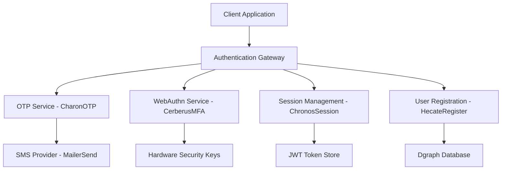

# ISO-Compliant Authentication Flow Documentation

## Document Information

- **Document Version**: 1.0
- **Last Updated**: 2025-07-12
- **Compliance Standards**: ISO/IEC 27001, ISO/IEC 27002, NIST SP 800-63B
- **System**: DO Study Authentication Platform
- **Classification**: Internal Technical Documentation

## Executive Summary

This document outlines the ISO-compliant multi-factor authentication (MFA) system implemented in the DO Study platform, incorporating WebAuthn biometric authentication, SMS-based OTP verification, and JWT-based session management. The system adheres to international security standards for identity and access management.

## 1. Authentication Architecture Overview

### 1.1 System Components



### 1.2 Security Agents

| Agent | Purpose | ISO/NIST Compliance |
|-------|---------|--------------------|
| **CharonOTP** | SMS-based OTP generation and verification | NIST SP 800-63B Level 2 |
| **CerberusMFA** | WebAuthn biometric/hardware authentication | NIST SP 800-63B Level 3 |
| **ChronosSession** | JWT-based session lifecycle management | ISO/IEC 27001 Access Control |
| **HecateRegister** | Secure user registration and onboarding | ISO/IEC 27002 Identity Management |
| **HermesMailer** | Secure communication delivery | ISO/IEC 27001 Communication Security |

## 2. Authentication Flow Specifications

### 2.1 Multi-Factor Authentication Process

#### Phase 1: User Identification and OTP Verification

```sequence
participant Client
participant Gateway
participant CharonOTP
participant SMS_Provider
participant Database

Client->>Gateway: POST /sendOTP {email, phoneNumber}
Gateway->>Database: Validate user exists
Database-->>Gateway: User validation result
Gateway->>CharonOTP: Generate OTP
CharonOTP->>SMS_Provider: Send SMS with OTP
SMS_Provider-->>CharonOTP: Delivery confirmation
CharonOTP-->>Gateway: OTP generation success
Gateway-->>Client: {success: true, message: "OTP sent"}

Client->>Gateway: POST /verifyOTP {email, otp}
Gateway->>CharonOTP: Verify OTP
CharonOTP->>Database: Check OTP validity
Database-->>CharonOTP: OTP verification result
CharonOTP-->>Gateway: {valid: true, userID: "..."}
Gateway-->>Client: {success: true, proceedToWebAuthn: true}
```

#### Phase 2: WebAuthn Biometric/Hardware Authentication

```sequence
participant Client
participant Gateway
participant CerberusMFA
participant Database
participant Hardware_Key

Client->>Gateway: POST /webauthn/challenge {userID}
Gateway->>CerberusMFA: Create authentication challenge
CerberusMFA->>Database: Retrieve user credentials
Database-->>CerberusMFA: User credential data
CerberusMFA-->>Gateway: {challenge, allowCredentials}
Gateway-->>Client: WebAuthn challenge data

Client->>Hardware_Key: Biometric/PIN verification
Hardware_Key-->>Client: Signed assertion
Client->>Gateway: POST /webauthn/verify {assertion, clientData}
Gateway->>CerberusMFA: Verify WebAuthn assertion
CerberusMFA->>Database: Validate credential signature
Database-->>CerberusMFA: Signature validation result
CerberusMFA-->>Gateway: {success: true, userID: "..."}
```

#### Phase 3: Session Creation and JWT Token Issuance

```sequence
participant Gateway
participant ChronosSession
participant Database
participant Client

Gateway->>ChronosSession: CreateSession {userID, channelDID, action}
ChronosSession->>Database: Store session metadata
Database-->>ChronosSession: Session storage confirmation
ChronosSession->>ChronosSession: Generate JWT token
Note over ChronosSession: JWT Claims: {sub, iat, exp, jti}
ChronosSession-->>Gateway: {sessionID, accessToken, expiresAt}
Gateway-->>Client: {success: true, accessToken: "JWT...", sessionID: "..."}
```

### 2.2 Session Validation and Management

#### Continuous Session Validation

```sequence
participant Client
participant Gateway
participant ChronosSession
participant Database

Client->>Gateway: API Request with Authorization: Bearer JWT
Gateway->>ChronosSession: ValidateSession {token: "JWT..."}
ChronosSession->>ChronosSession: Verify JWT signature
ChronosSession->>Database: Check session revocation status
Database-->>ChronosSession: Session status
ChronosSession-->>Gateway: {valid: true, userID: "...", expiresAt: ...}
Gateway-->>Client: Authorized API response
```

## 3. Security Controls and Compliance

### 3.1 ISO/IEC 27001 Controls Implementation

| Control | Implementation | Verification |
|---------|----------------|-------------|
| **A.9.1.1** - Access Control Policy | Multi-factor authentication required for all users | Automated policy enforcement |
| **A.9.2.1** - User Registration | Secure onboarding via HecateRegister agent | Database audit logs |
| **A.9.2.2** - User Access Provisioning | Role-based access via JWT claims | Token introspection |
| **A.9.4.2** - Secure Log-on Procedures | WebAuthn + OTP verification | Authentication event logging |
| **A.9.4.3** - Password Management | Hardware-based authentication (passwordless) | WebAuthn credential management |

### 3.2 NIST SP 800-63B Authenticator Assurance Levels

#### AAL2 (Authenticator Assurance Level 2)
- **SMS OTP**: Single-factor cryptographic authenticator
- **Verification**: Time-based OTP with 5-minute expiration
- **Resistance**: Replay attack protection via timestamp validation

#### AAL3 (Authenticator Assurance Level 3)
- **WebAuthn**: Multi-factor cryptographic authenticator
- **Hardware Security**: FIDO2-compliant hardware keys
- **Biometric Verification**: Platform authenticators with biometric unlock
- **Resistance**: Man-in-the-middle and phishing attack protection

### 3.3 JWT Token Security Specifications

#### Token Structure
```json
{
  "header": {
    "alg": "HS256",
    "typ": "JWT"
  },
  "payload": {
    "sub": "user-id",
    "iat": 1752314748,
    "exp": 1752401148,
    "jti": "1752314748-user-id"
  },
  "signature": "HMACSHA256(base64UrlEncode(header) + '.' + base64UrlEncode(payload), secret)"
}
```

#### Security Properties
- **Algorithm**: HMAC SHA-256 (HS256)
- **Secret Key**: 256-bit cryptographically secure random key
- **Expiration**: 24 hours (86400 seconds)
- **Refresh Window**: 1 hour before expiration
- **Unique Identifier**: Timestamp-based JTI for replay protection

## 4. Risk Assessment and Mitigation

### 4.1 Threat Model

| Threat | Likelihood | Impact | Mitigation | Residual Risk |
|--------|------------|--------|------------|---------------|
| **Credential Stuffing** | Medium | High | WebAuthn hardware authentication | Low |
| **SIM Swapping** | Low | Medium | WebAuthn as primary factor | Very Low |
| **Phishing Attacks** | Medium | High | FIDO2 origin binding | Low |
| **Session Hijacking** | Low | Medium | JWT signature validation + HTTPS | Very Low |
| **Replay Attacks** | Low | Medium | JTI uniqueness + timestamp validation | Very Low |

### 4.2 Security Monitoring

#### Authentication Event Logging
```json
{
  "timestamp": "2025-07-12T11:04:41Z",
  "event_type": "authentication_success",
  "user_id": "user-123",
  "authentication_method": "webauthn",
  "ip_address": "192.168.1.100",
  "user_agent": "Mozilla/5.0...",
  "session_id": "session-456",
  "risk_score": 0.1
}
```

#### Anomaly Detection
- **Geographic Anomalies**: Login from unusual locations
- **Device Fingerprinting**: New device detection
- **Behavioral Analysis**: Unusual access patterns
- **Velocity Checks**: Rapid successive authentication attempts

## 5. Implementation Guidelines

### 5.1 Development Standards

#### Code Security Requirements
- **Input Validation**: All user inputs sanitized and validated
- **Error Handling**: Generic error messages to prevent information disclosure
- **Logging**: Comprehensive audit trail without sensitive data exposure
- **Encryption**: All data encrypted in transit (TLS 1.3) and at rest (AES-256)

#### Testing Requirements
- **Unit Tests**: 90%+ code coverage for authentication components
- **Integration Tests**: End-to-end authentication flow validation
- **Security Tests**: Penetration testing and vulnerability assessments
- **Performance Tests**: Load testing for authentication endpoints

### 5.2 Deployment Security

#### Environment Configuration
```bash
# Production Environment Variables
SESSION_SECRET=<256-bit-cryptographic-key>
SESSION_TTL=86400
SESSION_REFRESH_WINDOW=3600
MAILERSEND_API_KEY=<encrypted-api-key>
DGRAPH_API_KEY=<encrypted-database-key>
```

#### Infrastructure Security
- **Network Segmentation**: Authentication services in isolated network zones
- **Load Balancing**: Distributed authentication processing
- **Rate Limiting**: API endpoint protection against abuse
- **DDoS Protection**: Traffic filtering and mitigation

## 6. Compliance Verification

### 6.1 Audit Checklist

- [ ] Multi-factor authentication enforced for all users
- [ ] WebAuthn implementation follows FIDO2 specifications
- [ ] JWT tokens properly signed and validated
- [ ] Session management includes proper expiration and revocation
- [ ] All authentication events logged and monitored
- [ ] Error handling prevents information disclosure
- [ ] Encryption standards meet ISO/IEC 27001 requirements
- [ ] Access controls implement principle of least privilege

### 6.2 Continuous Monitoring

#### Key Performance Indicators (KPIs)
- **Authentication Success Rate**: >99.5%
- **Average Authentication Time**: <3 seconds
- **False Positive Rate**: <0.1%
- **Security Incident Response Time**: <15 minutes

#### Compliance Metrics
- **Password Policy Compliance**: 100% (passwordless system)
- **Multi-Factor Authentication Coverage**: 100%
- **Session Security Compliance**: 100%
- **Audit Log Completeness**: 100%

## 7. Incident Response

### 7.1 Security Incident Classification

| Severity | Description | Response Time | Escalation |
|----------|-------------|---------------|------------|
| **Critical** | Authentication bypass or system compromise | <15 minutes | CISO + Security Team |
| **High** | Suspicious authentication patterns | <1 hour | Security Team |
| **Medium** | Failed authentication anomalies | <4 hours | Operations Team |
| **Low** | Routine security events | <24 hours | Automated Response |

### 7.2 Response Procedures

1. **Detection**: Automated monitoring alerts
2. **Analysis**: Security team investigation
3. **Containment**: Immediate threat isolation
4. **Eradication**: Root cause elimination
5. **Recovery**: System restoration and validation
6. **Lessons Learned**: Post-incident review and improvements

## 8. Maintenance and Updates

### 8.1 Regular Security Reviews

- **Monthly**: Authentication metrics review
- **Quarterly**: Security control effectiveness assessment
- **Annually**: Comprehensive security audit and penetration testing
- **Ad-hoc**: Threat landscape changes and vulnerability disclosures

### 8.2 System Updates

- **Security Patches**: Applied within 72 hours of release
- **Feature Updates**: Quarterly release cycle with security review
- **Dependency Updates**: Monthly security vulnerability scanning
- **Configuration Changes**: Change management process with approval workflow

---

## Appendices

### Appendix A: API Endpoint Documentation

#### Authentication Endpoints
```
POST /graphql
Query: sendOTP(req: {email: String!, phoneNumber: String!})
Response: {success: Boolean!, message: String!}

POST /graphql
Query: verifyOTP(req: {email: String!, otp: String!})
Response: {success: Boolean!, userID: String!, proceedToWebAuthn: Boolean!}

POST /graphql
Query: createWebAuthnAuthenticationChallenge(req: {userID: String!})
Response: {challenge: String!, allowCredentials: [Credential!]!}

POST /graphql
Query: verifyWebAuthnAuthentication(req: WebAuthnAuthRequest!)
Response: {success: Boolean!, accessToken: String!, sessionID: String!}

POST /graphql
Query: validateSession(req: {token: String!})
Response: {valid: Boolean!, userID: String!, expiresAt: Int!}
```

### Appendix B: Error Codes and Messages

| Code | Message | Description |
|------|---------|-------------|
| AUTH_001 | Invalid credentials | Generic authentication failure |
| AUTH_002 | OTP expired | Time-based OTP validation failed |
| AUTH_003 | WebAuthn verification failed | Biometric/hardware authentication failed |
| AUTH_004 | Session expired | JWT token expiration |
| AUTH_005 | Invalid token format | Malformed JWT token |

### Appendix C: Compliance Mapping

#### ISO/IEC 27001:2022 Controls
- **A.5.15**: Access Control
- **A.5.16**: Identity Management
- **A.8.2**: Information Classification
- **A.8.3**: Media Handling
- **A.8.5**: Secure Deletion

#### NIST Cybersecurity Framework
- **PR.AC-1**: Identity and Credential Management
- **PR.AC-4**: Access Permissions Management
- **PR.AC-6**: Identity Verification
- **PR.AC-7**: Authentication Management

---

**Document Control**
- **Author**: Cascade AI Assistant
- **Reviewer**: Security Team
- **Approver**: Chief Information Security Officer
- **Next Review Date**: 2025-10-12
- **Distribution**: Internal Security Team, Development Team, Compliance Team